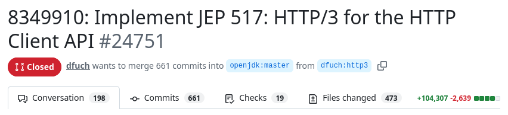

<!-- _class: lead -->

# JEP 517<br>HTTP/3 for the HTTP Client API

 @YujiSoftware

---

# JEP 517 の概要

- Java 26 で実装された JEP
- HTTP Client API で **HTTP/3 を送受信できるようになった**
- デフォルトのプロトコルは HTTP/2 のまま
  - 開発者が明示的に HTTP/3 を指定する必要がある

---
# そもそも HTTP/3 とは？

- HTTP（Hypertext Transfer Protocol） の最新バージョン
  - RFC 9114 として標準化された
- QUIC（**UDPベース**）上で動作
- 不安定な環境でも、低遅延かつ安定した接続を実現

<div class="info">
  高速で安定した環境の場合、HTTP/2よりも遅くなるとも言われている
</div>


---

# JEP 517 の実装

- [8349910: Implement JEP 517: HTTP/3 for the HTTP Client API by dfuch · Pull Request #24751 · openjdk/jdk](https://github.com/openjdk/jdk/pull/24751)
  - かなり大規模



---

# 使い方

- `HttpClient` または `HttpReuqest` でオプションを設定する
  - **Version.HTTP_3**
  - **HttpOption.H3_DISCOVERY**（任意）
- これ以外は、今までと同じ

```java
var request = 
    HttpRequest.newBuilder(uri)
        .version(HttpClient.Version.HTTP_3)
        .setOption(HttpOption.H3_DISCOVERY, Http3DiscoveryMode.ALT_SVC)
        .GET().build();
```
---

```java
import java.net.URI;
import java.net.http.*;
import java.net.http.HttpOption.Http3DiscoveryMode;

void main() throws java.io.IOException, InterruptedException {
    try (var client = HttpClient.newHttpClient()) {
        var uri = URI.create("https://www.google.com/");
        var request = HttpRequest.newBuilder(uri)
            .version(HttpClient.Version.HTTP_3)
            .setOption(HttpOption.H3_DISCOVERY, Http3DiscoveryMode.ALT_SVC)
            .GET().build();

        HttpResponse<String> response =
            client.send(request, HttpResponse.BodyHandlers.ofString());
        IO.println("Status code: " + response.statusCode());
        IO.println("Version: " + response.version());
    }
}
```

---

# H3_DISCOVERY の enum 値

- ANY （デフォルト）
- ALT_SVC
- HTTP_3_URI_ONLY

---

# H3_DISCOVERY.ANY

1. **HTTP/3 で**接続を試みる
2. 失敗（拒否された、またはタイムアウトした）したら、HTTP/2 にフォールバック

<hr>

- サーバが HTTP/3 に対応していないと、タイムアウトするまで待つ（2.75s）ので遅い

---

# H3_DISCOVERY.ALT_SVC

1. **HTTP/2 で**接続する
2. レスポンスヘッダーに `alt-svc: h3` が含まれていたら、次回からそのドメインに対して HTTP/3 で接続する

<hr>

- ブラウザと同じ挙動
- HttpClient インスタンスが `alt-svc` の指定を保持
  - インスタンスを作り直すと、1. からやり直し

---

# H3_DISCOVERY.H3_DISCOVERY

1. **HTTP/3 で**接続を試みる
2. 失敗（拒否された、またはタイムアウトした）したら例外
  - javax.net.ssl.SSLHandshakeException:<br> QUIC connection establishment failed
  - java.net.ConnectException:<br> No response from peer for 30 seconds

<hr>

- 現状、テスト以外で使うことはなささそう？

---

# まとめ

- Java 26 で JEP 517 が入った
  - HttpClient が HTTP/3 に対応した
- 使い方はとても簡単
  - ただし、オプションの指定に注意

- ぜひ使ってみましょう！

---

# 参考資料

- [JEP 517: HTTP/3 for the HTTP Client API](https://openjdk.org/jeps/517)
- [\[JDK-8349910\] Implement JEP 517: HTTP/3 for the HTTP Client API - Java Bug System](https://bugs.openjdk.org/browse/JDK-8349910)
- [8349910: Implement JEP 517: HTTP/3 for the HTTP Client API · openjdk/jdk@e8db14f · GitHub](https://github.com/openjdk/jdk/commit/e8db14f584fa92db170e056bc68074ccabae82c9#diff-4201fd070e7f248730b1637f8c7bd8a1b78ae78de2818a8dbf75c5bc70581f3a)
- [HttpClient (Java SE 26 & JDK 26)](https://docs.oracle.com/en/java/javase/26/docs/api/java.net.http/java/net/http/HttpClient.html)